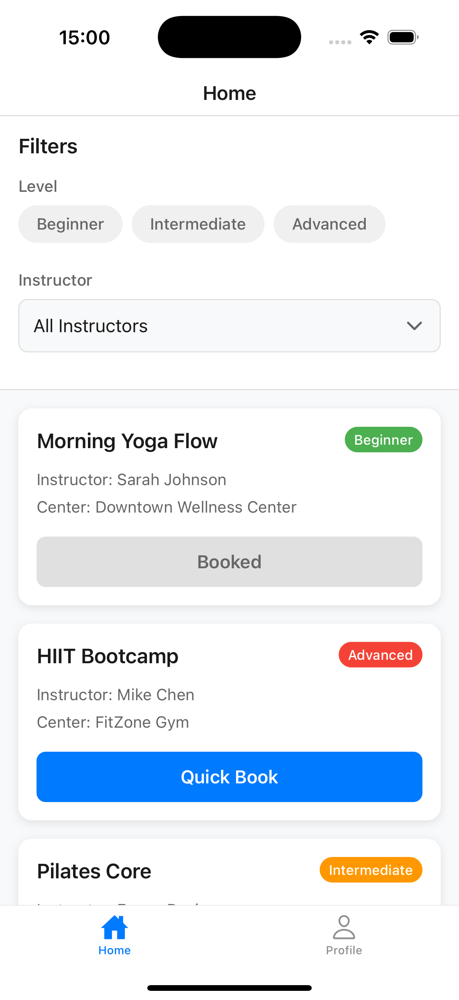
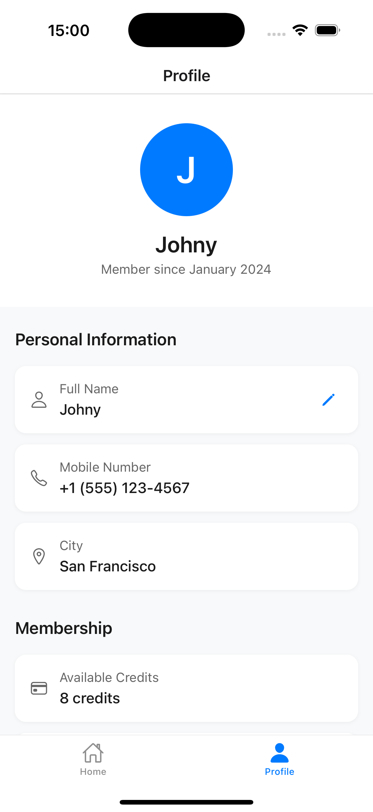

# Fit App

A small **Expo (React Native + TypeScript)** app with two screens:

- **Home** – Browse & filter classes, simulate booking

- **Profile** – Display and edit user details (stored locally)


## Preview

👉 [Watch it in action!](https://drive.google.com/file/d/1NxaalTpb0iqRFxeQKNDpRU5v1Y2YTjiH/view?usp=sharing)

## Screenshots

### Home Screen


### Profile Screen


## Features  

### Home Screen  

- List of Classes with:  
  - Class name  
  - Level (Beginner / Intermediate / Advanced)  
  - Instructor name  
  - Center name

- Filters:
    - Level → Filter chips (Beginner / Intermediate / Advanced)
    - Instructor → Dropdown / Modal list

- Class Card:
    - Shows metadata
    - Quick Book button:
        - Simulates booking with optimistic update
        - 15% chance of failure → rollback with error (toast/snackbar)

- States:
    - Loading → Spinner for 1–2s on startup
    - Empty State → Message + “Clear Filters” button

### Profile Screen

- Displays:
    - Avatar placeholder (circle)
    - User name
    - Mobile number
    - Membership credits
    - Additional static details (e.g., city, joined date)

- Editing:
    - Edit name (inline input or modal)
    - Stored locally only

## Tech Stack

- Expo + React Native
- TypeScript
- Mock Data (no backend required)
- State Management → React hooks (useState, useEffect)


## Installation Guide

### Prerequisites

Before you begin, make sure you have:

- **Node.js** (v20 or later) – [Download](https://nodejs.org/)

### Clone the Repository

```bash
git clone https://github.com/lipika1911/Fit-App.git
```

### Install Dependencies

```bash
npm install
```

### Run the App

```bash
npx expo start
```

### Run on:

- iOS Simulator → press i
- Android Emulator → press a
- Physical Device → scan QR with Expo Go app

## Design Choices and Trade Offs

- Optimistic UI for booking → feels instant, but rollback ensures correctness.
- Mock data → simplifies setup while showcasing state handling.
- Local state for profile edits 
- Minimal dependencies → kept project lightweight.
- Toast/snackbar for errors and success updates → clear feedback to user.